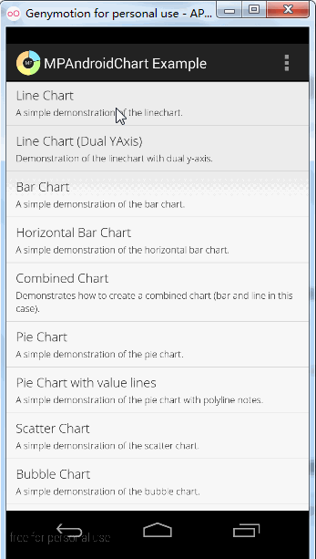
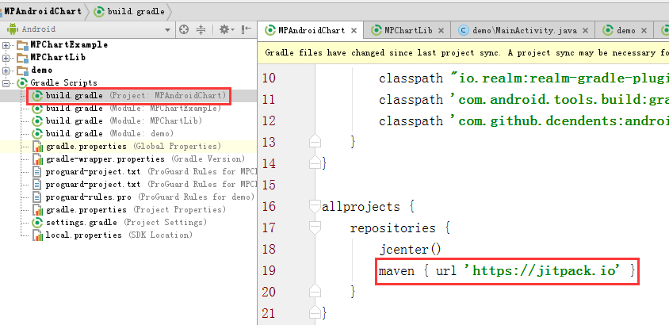

# MPAndroidChart项目使用

开源地址：[https://github.com/open-android/MPAndroidChart](https://github.com/open-android/MPAndroidChart "https://github.com/open-android/MPAndroidChart")

# 运行效果

详细效果请参考MPChartExample例子

## 使用步骤

### 1. 在project的build.gradle添加如下代码(如下图)

	allprojects {
	    repositories {
	        maven { url "https://jitpack.io" }
	    }
	}

### 2. 在Module的build.gradle添加依赖

    compile 'com.github.open-android:MPAndroidChart:v3.0.1'

### 3.调用功能绘制图表

##### 3.1布局文件使用

 	<com.github.mikephil.charting.charts.LineChart
        android:id="@+id/line_chart"
        android:layout_width="match_parent"
        android:layout_height="match_parent"/>

#### 3.2 Activity中初始化

    mChart = (LineChart) findViewById(R.id.line_chart);//初始化对应的Chart控件
	//省略部分代码，具体请参考MPChartExample例子实现想要的效果
    setData(1000, 500f);//给图表设置数据
    mChart.invalidate();//刷新

	

	
